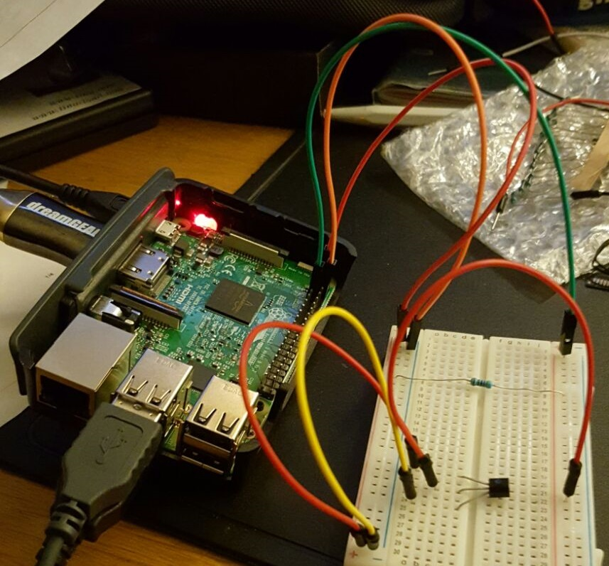

# Journal: Wie backt man einen Himbeerkuchen


## Inhaltsverzeichnis
1) [Intro](#intro)
2) [11.2.2017](#d1)
3) [25.2.2017](#d2)
4) [03.3.2017](#d3)
5) [06.5.2017 - 12.5.2017](#d4)
6) [13.5.2017](#d5)
6) [19.5.2017](#d6)
    
## <a name="intro"></a>Intro
Dies ist ein Journal für das Modul Steuerenungen mit Raspberry PI in der TSBE.
Das Journal wurde mit Markdown gemacht um mit der Techologie vertrauter zu werden.


## <a name="d1"></a>11.2.2017
Heute setzte ich mich mit dem Thema "Internet of Things" auseinander. Des weiteren machte ich das initiale Setup des Raspberry Pi
### Internet Of Things
- F: Was ist Internet of things?
- A: Verschiedene Geräte in einem Netz welche über dieser gesteuert werden können.
#### Vorteil
- Von überall erreichbar
- Bei richtigem Einsatz kann das Leben des Benutzers vereinfacht werden.

#### Nachteil
- Statistisch können damit sehr viele Daten gewonnen werden
- Der Aspekt Sicherheit wird gerne vernachlässigt


### Setup
Folgende Module wurden beim Initialen Setup des Raspberry Pies eingerichtet:
- WLAN wurde mittels raspi-config eingerichtet
- Tastatur Layout wurde auf CH-DE umgestellt
- VIM und nginx wurden installiert
- SSH aktiviert
- Passwörter wurden neu gesetzt

### Probleme & Lösungen
|Problem|Lösung|
|---|---|
|SSH loggin zuerst ging nicht -> no access kam als Fehlermeldung | Es wurde ein neuer user angeleget mit welchem das login funktionierte|
|Remote Desktop konnte keine Verbindung aufbauen | Es musste wie beschrieben das tastaturlayout eingerichtet werden. Zusätzlich musste noch das package vnc4server installiert werden und der xrdp service neu gestartet werden.|


### Linux Commands
Hier werden die wichtigsten Linux Commands kurz aufgelistet
```bash
$ ls -la      # list all directories and files
$ ifconfig    # shows net interface config
$ ping        # pings to ip or dns
$ python      # starts python shell
$ su          # change user
$ cd          # change directory
$ vim         # editor for editing files
```

## <a name="d2"></a>25.2.2017
### Linux Security Modul
Der User pi wurde gelöscht und ein User admin mit sudo Rechten wurde neu hinzugefühgt.
```bash
$ sudo adduser inter sudo
$ sudo kill -9 771
$ sudo deluser --force  -remove-home pi
```

### RPI Monitoring
Wurde sachgemäss nach anleitung auf GitHub Repo
[RPi-Monitor-deb](https://github.com/XavierBerger/RPi-Monitor-deb) installiert.

```bash
$ git clone https://github.com/XavierBerger/RPi-Monitor.git
$ make 
$ make install
```

Für die Installation von ShellInABox folgende Commands ausführen
```bash
$ apt-get install shellinabox
$ sudo vim /etc/default/shellinabox       # öffnet configfile
    
SHELLINABOX_PORT=19910                    # Im Config File Port ändern

$ /etc/init.d/shellinabox restart         # für restart des services
```

Um ShellInABox im RPM einzubinden muss im File /etc/rpimonitor/daemon.conf 
deamon.shellinabox auf den entsprechenden Port gemappt werden.

## <a name="d3"></a>03.3.2017
In dieser Übung musste ein Webserver mit FTP auf dem Raspberry Pi installiert werden.
Es wurde hierbei ein Apache2 Server mit PHP und MySql installiert
### Installation Webserver 

```bash
# Zuerst alle nötigen Module mit apt-get installieren
$ apt-get install php5
$ apt-get install mysql
$ apt-get install php-mysql5 phpmyadmin

$ vim /etc/apache2/apache.conf
# Include /etc/phpmyadmin/apache.conf -> end of the file
```

Anschliessend wurde ein php File mit dem Befehl 
phpinfo in das Verzeichnis /var/www/html gelegt

### FTP einrichten
Als erstes muss FTP installiert werden. 
```bash
$ apt-get install ftp
$ sudo vim  /etc/proftpd/proftpd.conf
 ```
Anschliessend muss die Config folgendermassen angepasst werden: (Am Ende des Files)
```smartyconfig
 DefaultRoot ~
 AuthOrder mod_auth_file.c  mod_auth_unix.c
 AuthUserFile /etc/proftpd/ftpd.passwd
 AuthPAM off
 RequireValidShell off
```
Danach muss noch ein neuer User hinzugefügt werden. Damit die Änderungen wirksam werden muss der FTP Servic neu 
gestartet werden.
```bash
 $ sudo ftpasswd --passwd \
                 --name admin \
                 --uid 33  \
                 --gid 33 \
                 --home /var/www/ \
                 --shell /bin/false  
 $ sudo /etc/init.d/proftpd restart 
```
Nun müssen noch die Rechte auf dem Ordner www vergeben werden
```bash
 $ chmod g+s /var/www
 $ chmod 775 /var/www
 $ chown -R www-data:www-data /var/www
```
Darauf achten das man sich im html verzeichnis befindet. 

## <a name="d4"></a>6.5.2017 - 12.5.2017 - Tortur mit 1-Wire
### 1-Wire

Beim 1-Wire tauchten diverse Probleme auf:
1) 1-Wire wurde falsch angeschlossen und brannte durch.
2) Die Module w1-gpio wurden nicht in die Datei /boot/config.txt hineingeshrieben -> dies ist nötig seit version ^3.0

Nach diversen Versuchen wurde eine Verkabelung gefunden, welche schlussendlich funktionierte.


Für die Schaltung wurde  ein 4.8 kOhm Widerstand verwendet.

Danach musste nur noch die Datei /boot/config.txt richtig konfiguriert werden.
```bash
modprobe w1-gpio pullup=1       # Kernel Module laden
modprobe w1-therm

$ vim /boot/config.txt
    
# In der Config hinzufügen
dtoverlay=w1-gpio-pullup
```
### OpenHab2
Um OpenHab zu installieren, muss vom [GitHub](https://github.com/openhab/openhabian/releases) das neuste Image 
heruntergeladen und installiert werden. Dies kann ganz einfach mit [Etcher](https://etcher.io/) 
auf die entsprechende SD Karte geladen werden.

Anschliessend muss das Raspberry Pi ans Internet angeschlosssen werden. Hierbei wird zieht das Image 
diverse Sourcen aus dem Netz.

Danach kann über einen Webbrowser auf die Webapplikation von Openhab zugegriffen werden. 

Zusätzlich habe ich noch ein GUI installiert. (XFCE)
Dazu musste ich folgende Befehle ausführen:
```bash
$ sudo su -                   
$ apt-get install x-org
$ apt-get install xfce
```

## <a name="d5"></a>13.5.2017
Heute habe ich Mathematika und das Kammeramodul des Rapberry eingerichtet

### Mathematika
Mathematika ist eine Software welche in der Wissenschaft zur Berechnung von Formeln genutzt wird.

```haskell
N[] => numerischer wert 
````
Bei nicht vollständiger angabe kann auf der nächsten zeile vortgefahren werden.

Mathematische Konstanten können mit Pi oder E ausgegeben werden

Mit Solve könen Gleichungen aufgelöst werden
```haskell
$ Solve [-12 +5x -2x +2y = +3 -4k -31k +9]
Out[] = -35k +2(x + y)
```

Mit Simplify können Therme vereinfacht werden
```haskell
$ Simplify [-12 +5x -2x +2y -1x +3 -4k -31k +9]
Out[] = -35k +2(x + y)
```
Mit Solve können gleichungen aufgelöst werden
Expand  => können terme auseinander genommen werden
Mit der Plot Funktion können Graphen ausgegeben werden.
```haskell
$ Plot[{funktion},{range}]
$ Plot[{x^2},{x,-1,1}]
```
### Kamera
Als erstes musste die Kamera in der Raspberry Config aktiviert werden.
Danach experimentierte ich mit den gegebenen Befehlen ein wenig herum.
```bash
$ raspistill -w 640 -h 480 -o bild.jpg
$ raspistill --nopreview --timeout 1 --quality 50 -o bild.jpg
$ raspivid -t 8000 -o video.h264
```
### Überwachungskamera
Für die Überwachungskamera habe ich selber ein Modul mit NodeJS geschrieben.
Hierzu habe ich 2 Module geschrieben.
- Modul 1 gibt eine Statische Website zurück
- Modul 2 schreibt ein aktuelles Bild in einen Ordner von Modul 1


## <a name="d6"></a>19.5.2017:

### LED Steuerung
In einem ersten Schritt konnte das LED mit dem Pythonscript angesteuert werden.
Die Standart Python Installation reichte jedoch nicht aus. Es mussten noch zwei weitere Packete installiert werden.
```bash
$ apt-get install python-dev
$ apt-get install python-rpi.gpio

```


### Webmin

```bash
$ wget http://prdownloads.sourceforge.net/webadmin/webmin-1.710-minimal.tar.gz
$ tar -zxvf webmin-1.710-minimal.tar.gz
```

### Cups
Cups wurde nach folgender Anleitung eingerichtet und konfiguriert [CUPS Anleitung](https://www.elektronik-kompendium.de/sites/raspberry-pi/2007081.htm)
Der Cups Service hört auf den Port 631

## 21.5.2017
### NFC
Als erstes muss in raspi-config unter Interface options das Modul SPI aktiviert werden.
Danach wurden die Treiber installiert.
Hierzu habe ich die Treiber per FTP in das Verzeichnis Download gelegt und anschliessend installiert.
```bash
$ dpkg -i *
```

Dieser Command hat einen Fehler produziert, welcher auf [Github](https://github.com/firsttris/mfrc522-rpi/issues/1) gemeldet wurde
```bash
$ explorenfc-cardemulation -t test
```
Der Command um NFC Karten auszulesen hat funktioniert. 
```bash
$ explorenfc-basic –k
ISO 14*****: *
ISO 14*****: *
ISO UID    : *
```
Die NFC Karten kann man sehr gut mit Python ansteuern, weshalb wir dies auf dem Raspi noch installieren.
Die zur Verfügung gestellten Scripts benötigen zusätzlich noch ein Python Modul, welches mit pip installiert werden kann.
```bash
$ sudo apt-get install python-dev 
$ sudo apt-get install python-pip 
$ pip install nxppy 
```
Danach kann das Script read_content.py ausgeführt werden.

Fehler gab es beim Ausführen des read_content.py Files. Anscheinend hat pip das Modul nicht richtig installiert.
Ansatz PIP funktioniert nicht
```bash
$ sudo apt-get purge python-pip python-setuptools
$ curl -O https://bootstrap.pypa.io/get-pip.py
$ sudo python get-pip.py
$ sudo apt-get install cmake            # wird anscheindend für das building verwendet
```


## Glossar
|Begriff|Erklährung|
|---|---|
|RPI|Raspberry Pi Interface|
|Bash| Born against shell: Terminal|
|Python|Scriptsprache|
|NodeJS|Scriptsprache|
|FTP|File Transfer Protocol|
|1-Wire|Temparatursenson|
|CUPS|Printservice|